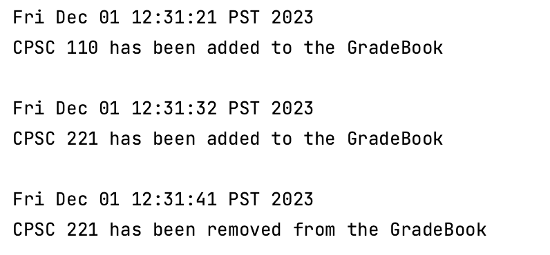
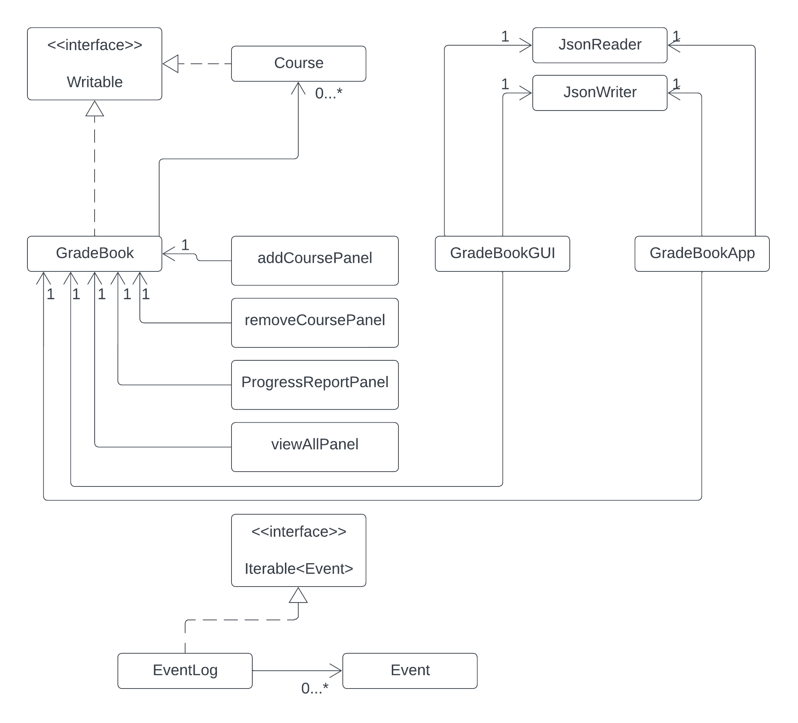

# Student Grade Book

## Overview:
The Student Grade Book is a Java desktop application designed to assist students in effectively managing their academic performance. It offers a range of features to help students organize and monitor their courses, grades, and credits earned.

## Key Features:
- **Course Management** : Users, primarily students, can add courses to the grade book, providing essential details such as the course name, overall course grade, and credits earned.
- **Course Removal** : Students can remove courses from their records when necessary.
- **Course List** : The application allows users to view a comprehensive list of all the courses they've added, providing easy access to their academic history.
- **Performance Analysis** : Students can calculate the total average grade and total credits earned, helping them assess their overall academic progress.

## Target Audience: 
This application is tailor-made to students at all educational levels, from high school to college and beyond. It offers a convenient and efficient way for students to organize and keep track of their academic records.

## Motivation: 
As a student myself, I understand the importance of efficiently managing course grades and assignments. This project not only enhances my personal academic journey but also serves as a valuable solution for fellow students, offering them an effective means to manage their academic records.
This application aims to simplify academic record-keeping, empowering students to focus on their studies with ease.

## User Stories:

- As a user, I want to be able to add a course to my grade book, providing the course name, overall grade, and credits earned.

- As a user, I want to be able to remove a course from my grade book, so I can update my records when necessary.
- As a user, I want to view a list of all the courses I've added to my grade book, including their names, overall grades, and credits earned, for a quick overview of my academic history.
- As a user, I want to calculate the total average grade of all the courses in my grade book.
- As a user, I want to calculate the total credits earned from all the courses in my grade book.
- As a user, I want to be able to save my GradeBook to file (if I so choose)
- As a user, I want to be able to be able to load my GradeBook from file (if I so choose)

## Instruction for User:
- You can add a course to the grade book by clicking on add course button
- You can remove a course from the grade book by clicking on remove course button
- You can view all the course added to the gradebook by clicking on view all button.
- You can view the average grade and total credits along with all the courses, with individual grade and credits for each course.
- After you’ve finished, you can save the gradebook by clicking on save button.
- When you first open the gradebook, load the data using the load button.
- You can exit the application by clicking on quit button

## Phase 4: Task 2

When the user adds a course to the gradebook, that event gets saved to event log and later print it when we exit the application.
For instance, user has added CPSC 110 course to the grade book. It prints this:

When the user removes a course from the gradebook, that event gets saved and prints at the end.
For instance, user has removed CPSC 221 course from the gradebook. It prints this:

Here, we are adding two courses CPSC 110 and CPSC 221. Then, removing CPSC 221.
This is how it prints in the console:

## Phase 4: Task 3

Refactoring:

I would do refactoring in the GradeBookGUI because it has the main home panel and controls/initiates other panels as well. 
So,I can refactor this by writing mainpanel in the different class and initiate all the panels (including main panel) in GradeBookGUI. 
This can be achieved using the cardLayout function, which displays one panel at a time. Since, I did not have enough knowledge 
about it, I wasn't able to do it.

Another improvement could be, instead of having two buttons, one for view all and one for progress report. I can just have
progress report only. Because both the buttons displays courses but progress report has more details like total credits, 
average and individual course information.